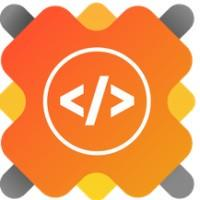
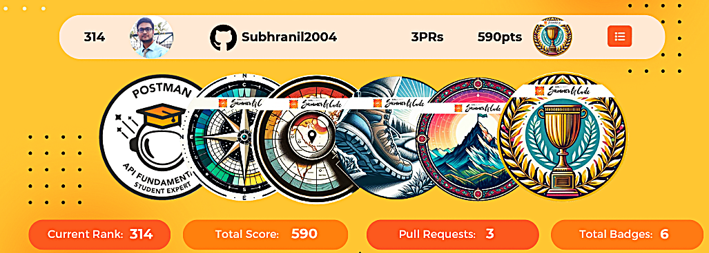

<h1 align="center">Hi 👋, I'm Subhranil</h1>

<!--# 💫 About Me:) -->
🔭 Actively working on `ML` applications across various domains, `healthcare`, for instance.

🌱 Currently pursuing a B.Tech in Information Technology `(IT) at IIEST, Shibpur`.

💬 AMA about ***Machine Learning!***

🎹 My hobbies include playing the synthesiser, reading, and staying fit.

⚡ Fun fact: I went scuba-diving in the Andamans and paragliding in Kalimpong, and 'twas really exhilarating. 😜

<!--🌐 Connect with me:  -->
 
<h3><b>🛠 Tech Stack/ Certifications</b></h3>

<b>Languages & Databases:</b>  &nbsp;
&nbsp;
&nbsp;
&nbsp;
&nbsp;
&nbsp; 
<b>Frameworks and Libraries:</b>  &nbsp;
&nbsp;
&nbsp;
&nbsp;
&nbsp;
&nbsp;
&nbsp;
&nbsp; 
<b>Tools and Platforms:</b>  &nbsp;
&nbsp;
&nbsp;
&nbsp;
&nbsp;
&nbsp; 
<b>Embedded Systems & OS:</b>  &nbsp;
&nbsp;
&nbsp;
&nbsp;

<!-- 

 
<h3 style="display: inline; cursor: pointer;">🛠️ Tech Stack (Click to view) </h3>

  
          
  
       
 
  
   
      
   

 -->

###   GSSoC'24 Badges

### 🔝 My Top-10 Contributed Repositories

  

### 📊 Stats

  
  
   
  
  

### ✍️ Fun and Philosophy
 

---

